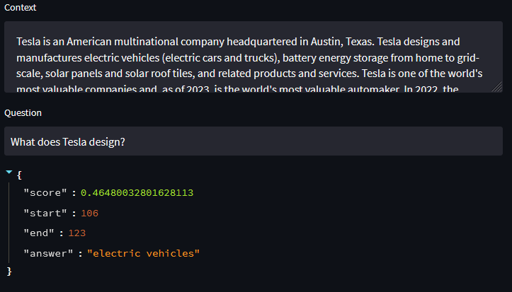

# Question Answering Model using Transformers

This repository contains code for training a Question Answering (QA) model using the Hugging Face Transformers library. The model is trained on the Stanford Question Answering Dataset (SQuAD).

## Dataset

The SQuAD dataset is loaded using the load_dataset function from the datasets library. The dataset contains questions and corresponding context passages. The squad variable holds the loaded dataset.
Model

The QA model in this code uses the BERT (Bidirectional Encoder Representations from Transformers) architecture with a cased base model checkpoint. The BERT model is loaded using the AutoModelForQuestionAnswering class from the Transformers library. The model's tokenizer is also instantiated using the AutoTokenizer class.

## Preprocessing

The preprocess_function is defined to preprocess the examples from the dataset. It tokenizes the questions and context passages using the tokenizer, truncates the inputs to a maximum length of 512 tokens, and handles padding. It also determines the start and end positions of the answer within the context passage based on the provided offsets. If the answer is not fully inside the context, it is labeled as (0, 0). The preprocessed inputs are returned as a dictionary.

The preprocess_function is applied to the SQuAD dataset using the map function. The preprocessed dataset is stored in the tokenized_squad variable. The remove_columns parameter is used to remove unnecessary columns from the dataset.

## Training

The training process is defined using the TrainingArguments and Trainer classes from the Transformers library. The TrainingArguments specify the training configuration, such as the output directory, evaluation strategy, learning rate, batch size, and number of epochs. The Trainer combines the model, training arguments, datasets, tokenizer, and data collator to facilitate the training process.

The Trainer is initialized with the BERT QA model, training arguments, tokenized training and evaluation datasets, tokenizer, and data collator. The train method is called on the Trainer object to start the training process.

## Result

After training, the trained QA model is saved in the "qa_model" directory specified in the training arguments. The model can then be used for question answering tasks on new unseen data.
